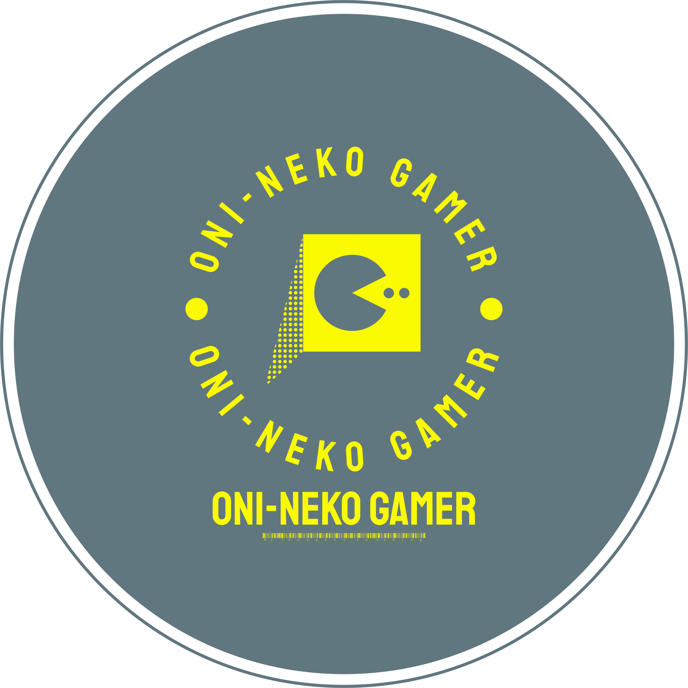

# Table of Contents
1. [Overview] (#https://github.com/Aansteydev/Milestone-Project-1-oni-neko-gamer/blob/main/README.md#overview)
2. [UX] (#ux)
- [Scope] (#scope)
- [Requirements] (#requirements)
- [Encourage Footfall]
3. [Structure]
- [Home Page]
- [Preview Page]
- [Subscribe Page]
4. [Skeleton]
- [Wireframes]
5. [Surface]
- [Logo]
- [Colours]
6. [Features]
  - [Existing Features]
  - [Navigation Bar]
  - [Footer]
  - [Subscription Form
7. [Future Improvements]
- [Form Submission]
- [Security]
    
# Milestone Project One
## Video Game Blog - Oni Neko Gamer
---

---
### __Overview__ 
This project has been created as a way to promote a blog that is focused on Video Games, especially Japanese retro games. I am aiming to promote the gaming blog Oni Neko Gamer to a new audience of readers and contributors and to give potential customers an easy way to subscribe to the blog or to put in a request to contribute a piece of work for the blog.

I have used two coding languages __HTML__ and __CSS__ to create this website.

---

### __UX__
Oni Neko Gamer has recently ran a poll within its current reader base of around 100 readers, with about 20 of them being the most avid readers on Wordpress where the blog is hosted currently. The questions that were posed to the polling group were based on how to get more footfall for the site which lead us to the suggestion that Oni Neko Gamer should be rewritten by using HTML and CSS to create a new, more proffessional look for the blog.
---
## __Scope__

### __Requirements__

##### __Encourage Footfall__

- Clear detailed description about the blog and its contents on the first page
- Improved visuals and layout to ensure that the user has an easy time navigating the blog
- Promotional advertising will be used on forums and online gaming groups via social media

##### __Convey Ethos and Purpose__

- The main services that the blog provides are outlined on the "Home" page
- The "Preview" page provides bite sized chunks of work for perspective readers to view
- The Subscribe page is to be used for feedback and user content submissions which will become more important in the future of the site

### __Structure__

##### __Home Page__

- An introduction to what the blog is about.
- The logo is placed near the top of the page so that it will grab the users attention and they will be able to assertain that the site is based on Video Games.
#### __User Goal__
- Accessibility and easy navigation of the website.
- An introduction to the writer and an explanation of what the site does.
#### __Business Goal__
- Introduce the reader to a new source of Video Game journalism.
- Explain the Ethos of the blog to new readers.
- Explain the reason for the transition from Worpress (Student Fullstack Dev)
- Explanation of the expansion of the site by accepting "user content".

### Preview Page
- Gives examples of the writers work.
- Large logo in the same place on every page. 
- Provides box art for the titles that have been reviewed.
- Provides an embeded video https://www.youtube.com/embed/KfdSiRRUVSM.
- Large image above the footer.
#### __User Goal__
- Be able to read some of the writers previous work.
- Understanding of the various regularly written columns.
- View media that portrays the writers gaming interests.
#### __Business Goal__
- Entice the reader with images and well written articles.
- Express a deep understanding of the subject matter.
- Create new regular visitors to the site.
### __Subscribe__
-Form for submitting details for updates and requests.
-Large image above the footer.
#### __User Goal__
- Ease of use for the user.
- Clear instructions.
- Consitent outlay to previous pages.
### __Business Goal__
- More subscribers to extend the blogs popularity.
- Easy to use request box for ideas for reader written content.
### __Skeleton__
#### __Wireframes__
I have used the Balzamic application to create the wireframes for this project, however once I began to write the code for this project I realised that the layout was not going to work for my project so it has changed slightly in the final version.  

### __Surface__
The aesthetical choices were made to give a feeling of nostalgia by invoking contrasting colors such as grey and yellow to create a visual representation of looking back on old and forgotten games with a renewed sense of reflection and knowledge of the subject matter.
#### __logo__ 
The logo was created on [Logo.com](https://logo.com/) by using their creation tools. The font was chosen as a way to imprint nostalgia on to the reader and with the use of PacMan in the the middle of the logo I feel that it is an effective tool to allow the reader to know what they are looking at within the first five seconds of visiting the page. 

#### __Colours__
I first created the logo and this became a large part of the colour scheme for this project, the logo was designed in various colours but the one that stood out to me the most was the current choice with its simple combination of yellow and grey. These colors became the majority of the color scheme which is split up with a white navigation bar at the top of the page which features the ghosts from PacMan to brighten up the site and to tie back in with the logo and theme.

the two primary colours are:
Grey : #61777F (Background colour)
Yellow: #fafa03(chosen for the logo, headings and footer)

### __Features__
---
#### __Existing Features__
#### __Navigation Bar (Navbar)__
The Navbar has been placed on every single page to help the user navigate the website with ease. I have implemented hover on the available links to different webpages to give a response back to the user, the color on hover is representative of the ghosts from PacMan which will encourage the user to press the link, on smaller screens the Navigation bar is turned into a Burger menu to help mobile users traverse the website.
#### __Footer__
The footer has followed the same color scheme as the logo by using the same shade of Yellow(#FAFA03) the footer includes Copyright information, a link to email me and a link to the project on Github. The main reason for picking Yellow as the colour for the footer was to end the page with a familiar colour and one that will brighten up the bottom of the page instead of having a large chunk of Grey space. The space between the end of the content and the beginning of the footer is taken up by images on every single page to break up the page and to retain the users attention. 
#### __Subscription Form__
I created a simple form for people to use to subscribe to the website but it is also for writers to reach out and contact Oni Neko Gamer to talk about writing community features and reviews for the website. The form doesn't post when submitted but instead the user is greeted by a modal which thanks them for subscribing to the page and then the form resets. 

### __Future improvements__
---
#### __Form Submission__
Currently upon completion of the form, no information is saved anywhere but instead the user sees a modal that thanks them for subscribing. I would like to store the data in the future and this will be acheived by using other programming languages such as Python and SQL. 
#### __Security__
The use of CAPTCHA protection will be implemented in the future to prevent bot attacks and spam this will be used for form submission.

---
### --Technologies used--
- This project was written in HTML5 and CSS with the aid of Bootstrap 5.
- This project was written in Codeanywhere.
- The project was debugged with Chrome Developer Tools.
- This project has used Github to store source code.
- The Code Institutes template was used for this project.
- The project uses fonts that were sourced from Google Fonts.
- The project uses Bootstrap version 5.3.0.
- The projects accessibility was checked periodically with Wave.
- The images used in this project have been compressed with Tinyjpg.
- The wireframes for this project were created in Balzamic.
- The HTML was checked through W3C's HTML markup validator.

