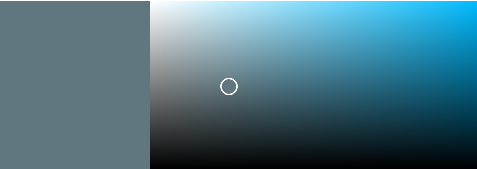

# Table of Contents
1. [Overview](#overview) 
2. [UX](#ux) 
       -[Strategy](#strategy)
      - [Scope](#scope)
      - [Encourage Footfall](#encourage-footfall)
4. [Structure](#structure)
      - [Home Page](#home-page)
      - [Preview Page](#preview-page)
      - [Subscribe Page](#subscribe-page)  
5. [Skeleton](#skeleton)
      - [Wireframes](#wireframes) 
6. [Surface](#surface)
      - [Logo](#logo)
      - [Colours](#colours)
7. [Features](#features)
     - [Existing Features](#existing-features)
     - [Navigation Bar](#navigation-bar)
     - [Footer](#footer)
     - [Subscription Form](#subscription-form)
8. [Future Improvements](#future-improvements)
      - [Form Submission](#form-submission)
      - [Security](#security)
9. [Technologies Used](#technologies-used)
10. [Testing](#testing)
11. [Acknowledgements](#acknowledgements)
    
# Milestone Project One
## Video Game Blog - Oni Neko Gamer
This project is for a static website which is functioning as a promotional site for a gaming blog [view website on github pages](https://aansteydev.github.io/Milestone-Project-1-oni-neko-gamer/)
---

---
# __Overview__ 
This project has been created as a way to promote a blog that is focused on Video Games, especially Japanese retro games. I am aiming to promote the gaming blog Oni Neko Gamer to a new audience of readers and contributors and to give potential customers an easy way to subscribe to the blog or to put in a request to contribute a piece of work for the blog.

I have used two coding languages for the majority of work which are __HTML__, __CSS__ , a small amount of inline __CSS__ for the Font Awesome icons that I have used and a small amount of __Javascript__ to create this website. This website is a culmination of months of hard work which has turned into a labour of love that has cemented my passion for coding and I sincerely hope that you enjoy looking at it as much as I have enjoyed creating it.

---

# __UX__
Oni Neko Gamer has recently ran a poll within its current reader base of around 100 readers, with about 20 of them being the most avid readers on Wordpress where the blog is hosted currently. The questions that were posed to the polling group were based on how to get more footfall for the site which lead us to the suggestion that Oni Neko Gamer should be rewritten using HTML and CSS with Javascript in the near future to create a new, more proffessional look for the blog. This is being created in hopes of attracting a larger reader group whilst being able to promote a unique brand identity in an over satuated market. The following strategy has been developed over five different planes of design 
1. Strategy
2. Scope
3. Structure
4. Skeleton
5. surface

All five of the planes represent the indivual planning elements and they will all be covered in detail as you read through this document.

---
# __Strategy__ 
## __Creator Stories__
Creater Goals
-To make an asethetically appealing website which is easy to identify as a unique brand.
- The site needs to be as user friendly as possible with clear seperation of pages.
- As a creator it is important to me that the user is engaged and interested by the sites content.
- All of the content must flow coherently and with purpose.
- The topic of the page needs to be clear for the user and this will be achevied with the logo that I have created and by utilising Font Awesome icons.
- I want the user to engage with the site as much as possible so an interactive element such as the ability to contact the creator or to submit reviews will need to be implemented.
  ## __User Stories__
  First time visitor goals,
  - As a first time visitor I want to be able to understand the theme of the webpage without having to search for it.
  - I want to have clear indications of what page I am currently visiting I.E the Homepage, as well as being able to navigate my way around the site without issue.
  - As a first time visitor I want to be engaged by the content of the website, whether this is done by text, images or video.
  - Since this page is serving as a taster of a full and more developed website I will want to get an idea of the authors writing style so that I can ascertain whether I want to keep on engaging with the author.
  - I want the website to be clear and easy to look at it.

    Returning visitor goals,
    - As a returning visitor I want to be able to engage with the websites author.
    - I would also like to be able to view more work in the near future.
 
      Unfortunately none of my friends or family are gamers so instead I have created a website that I would be excited to find and would be excited to contribute to or interactive with. I have tried to make the contents clear for people that aren't interested in the hobby in the hopes that it could become an introduction for them. I recieved feedback from family members, friends and my partner and the feedback has lead me to believe that I have acheived what I aimed to do. 
    - 
# __Scope__
## __Encourage and allow user engagement__
- To attain more readers to the blog.
- The addition of reader submitted work.
- Use of the form to communicate with the readers.

## __Encourage Footfall__

- Clear detailed description about the blog and its contents on the first page
- Improved visuals and layout to ensure that the user has an easy time navigating the blog
- Promotional advertising will be used on forums and online gaming groups via social media

## __Convey Ethos and Purpose__

- The main services that the blog provides are outlined on the "Home" page
- The "Preview" page provides bite sized chunks of work for perspective readers to view
- The Subscribe page is to be used for feedback and user content submissions which will become more important in the future of the site

# __Structure__

## __Home Page__

- An introduction to what the blog is about.
- The logo is placed near the top of the page so that it will grab the users attention and they will be able to assertain that the site is based on Video Games.
## __User Goal__
- Accessibility and easy navigation of the website.
- An introduction to the writer and an explanation of what the site does.
## __Business Goal__
- Introduce the reader to a new source of Video Game journalism.
- Explain the Ethos of the blog to new readers.
- Explain the reason for the transition from Worpress (Student Fullstack Dev)
- Explanation of the expansion of the site by accepting "user content".

## Preview Page
- Gives examples of the writers work.
- Large logo in the same place on every page. 
- Provides box art for the titles that have been reviewed.
- Provides an embeded video https://www.youtube.com/embed/KfdSiRRUVSM.
- Large image above the footer.
## __User Goal__
- Be able to read some of the writers previous work.
- Understanding of the various regularly written columns.
- View media that portrays the writers gaming interests.
## __Business Goal__
- Entice the reader with images and well written articles.
- Express a deep understanding of the subject matter.
- Create new regular visitors to the site.
## __Subscribe__
-Form for submitting details for updates and requests.
-Large image above the footer.
## __User Goal__
- Ease of use for the user.
- Clear instructions.
- Consitent outlay to previous pages.
## __Business Goal__
- More subscribers to extend the blogs popularity.
- Easy to use request box for ideas for reader written content.
# __Structure__
The website has been designed as a way to get as much information across to the reader without it being overwhelming, this is a difficult juggling act because the more information that you make available the higher your chances are of the reader being fatigued or overwhelmed so my first instinct was to try to break the paragraphs up into manageable chunks and to make sure that the pages themselves weren't too long. 
The paragraphs all need to be clearly seperated from one another with enough breathing space that they won't give the impression of a dense block of text. The background colours that I chose also help to lighten the mood of the page and to create a feeling of relaxation as I want the reader to enjoy their time whilst reading my work, so I chose two colours that are part of the logo for Oni Neko Gamer, these are,
Yellow #fafa03
Grey 61777f 
whilst the yellow is relatively bright this should imbue a sense of fun and colour whilst the grey helps to ease the reader into the work and create a good environment for reading almost akin to a dark mode of sorts.

I have also included Font Awesome icons to the Navbar which has not only helped to signify the theme of the site but adds some colour to the page, The icons are in the form of ghosts from Namco's arcade classic PacMan and by hovering over the ghosts which function as links for the other pages of the site the text colour will change upon mouse hover and will lose it's colour to signify what page you're currently visiting.

I have also included a slight colour change on hover to the Octocat link to Github and my email address in the footer, this is to provide feedback to the user to ensure that they feel confident that the link is in fact clickable and will redirect them to the source code. 

I have also endevoured to ensure that the website is responsive across all screen sizes and devices, this has aided me to ensure that all future projects will be responsive and I have learned a lot from my time configuring this project. The Subscribe button on the subscribe page also features a change of colour on hover and will initiate a Javascript script which was written by my mentor Benjamin Kavanaugh.

## __Typography__
I have used Roboto throughout the project with differening text weights as Roboto is a very easy to read font I was confident that it was the right choice for this project after an exhaustive search through Google Fonts. Sans serif has been added as a backup in case Roboto doesn't load. The font has been repeated throughout the page to gain consistency throughout the project, the header and footer both feature the same font. 

# __Skeleton__
## __Wireframes__
I have used the Balzamiq application to create the wireframes for this project, however once I began to write the code for this project I realised that the layout was not going to work for my project so it has changed slightly in the final version. The initial iterations of the website should be treated as a prototype and the final project as an evolution on the original idea.  
## __Balzamiq Wireframe files__
[Home page](https://github.com/Aansteydev/Milestone-Project-1-oni-neko-gamer/assets/137046660/75a029ad-0829-4f29-b3b1-0deea2a32eaa)

[Preview](https://github.com/Aansteydev/Milestone-Project-1-oni-neko-gamer/assets/137046660/8e1819c5-b16a-4ed2-8388-b8d547628d78)

[Subscribe](https://github.com/Aansteydev/Milestone-Project-1-oni-neko-gamer/assets/137046660/27ed654b-9e4a-4b2f-8b60-1bd6763ce5d9)

# __Surface__
The aesthetical choices were made to give a feeling of nostalgia by invoking contrasting colors such as grey and yellow to create a visual representation of looking back on old and forgotten games with a renewed sense of reflection and knowledge of the subject matter.
## __logo__ 
The logo was created on [Logo.com](https://logo.com/) by using their creation tools. The font was chosen as a way to imprint nostalgia on to the reader and with the use of PacMan in the the middle of the logo I feel that it is an effective tool to allow the reader to know what they are looking at within the first five seconds of visiting the page. 

## __Colours__
I first created the logo and this became a large part of the colour scheme for this project, the logo was designed in various colours but the one that stood out to me the most was the current choice with its simple combination of yellow and grey. These colors became the majority of the color scheme which is split up with a white navigation bar at the top of the page which features the ghosts from PacMan to brighten up the site and to tie the sceheme back in with the logo and theme.

the two primary colours are
Grey #61777F:
Yellow #fafa03:

# __Features__
---
## __Existing Features__
## __Navigation Bar (Navbar)__
The Navbar has been placed on every single page to help the user navigate the website with ease. I have implemented hover on the available links to different webpages to give a response back to the user, the color on hover is representative of the ghosts from PacMan which will encourage the user to press the link, on smaller screens the Navigation bar is turned into a Burger menu to help mobile users traverse the website.
## __Footer__
The footer has followed the same color scheme as the logo by using the same shade of Yellow(#FAFA03) the footer includes Copyright information, a link to email me and a link to the project on Github. The main reason for picking Yellow as the colour for the footer was to end the page with a familiar colour and one that will brighten up the bottom of the page instead of having a large chunk of Grey space. The space between the end of the content and the beginning of the footer is taken up by images on every single page to break up the page and to retain the users attention. 
## __Subscription Form__
I created a simple form for people to use to subscribe to the website but it is also for writers to reach out and contact Oni Neko Gamer to talk about writing community features and reviews for the website. The form doesn't post when submitted but instead the user is greeted by a modal which thanks them for subscribing to the page and then the form resets. 

# __Future improvements__
---
## __Form Submission__
Currently upon completion of the form, no information is saved anywhere but instead the user sees a modal that thanks them for subscribing. I would like to store the data in the future and this will be acheived by using other programming languages such as Python and SQL. 
## __Security__
The use of CAPTCHA protection will be implemented in the future to prevent bot attacks and spam this will be used for form submission.

---
# __Technologies used__
- This project was written in HTML5 and CSS with the aid of Bootstrap 5.
- There is a small amount of Javascript used on the subscription form which was written by my mentor Benjamin Kavanagh.
- This project was written in [Codeanywhere](https://app.codeanywhere.com/).
- The project was debugged with [Chrome Developer Tools](https://developer.chrome.com/docs/devtools/).
- This project has used [Github](https://github.com/) to store source code.
- The Code Institutes template was used for this project.
- The project uses fonts that were sourced from [Google Fonts](https://fonts.google.com/).
- The project uses [Bootstrap version 5.3.0](https://getbootstrap.com/docs/5.3/getting-started/introduction/).
- The projects accessibility was checked periodically with [Wave](https://wave.webaim.org/extension/).
- The images used in this project have been compressed with [Tinyjpg](https://tinyjpg.com/).
- The wireframes for this project were created in [Balzamic](https://balsamiq.com/).
- The HTML was checked through [W3C's HTML markup validator](https://validator.w3.org/).
  
  # __Testing__
  ---
  Testing User stories from User Experience Design (UX) Section
  ## __Further Testing__
  ---
  - The project was tested through Google Chrome using the built in Develeper tools function to test the sites compatability on different devices with varying screen sizes succesfully.
  - The project was tested on a Google Pixel 6 mobile phone and a Asus Zephyrus laptop that features a 12" inch display
  - Google Chrome develeper tools allowed me to emulate different devices to test the responsiveness on each device
  - The devices emulated are as follows,
  - Iphone SE
  - Iphone XR
  - Iphone 12 Pro
  - Google Pixel 5
  - Samsung Galaxy S8+/S20 Ultra
  - Ipad Air
  - Ipad Mini
  - Surface Pro 7
  - Surface Duo
  - Galaxy fold
  - Samsung Galaxy A51/71
  - Nest Hub
  - Nest Hub Max
  I have also used the W3C Validator service to check the validity of the code,
## __W3C CSS Validator__
- W3C CSS validator screenshot 
      - [css code validation](assets/images/CSS-validator.png) 
- W3C HTML validation screenshots
      - [home page results](assets/images/homepage-w3c.png)
      - [preview page results](assets/images/preview-w3c.png)
      - [subscribe page results](assets/images/subscribe-w3c.png)
---
# __Acknowledgements__
- I would like to thank my Mentor Benjamin Kavanagh who has encouraged me throughout this project whilst providing incredibly helpful feedback and has always tried his best to ensure that I am working to my full potential, his experience in the field has been priceless.
